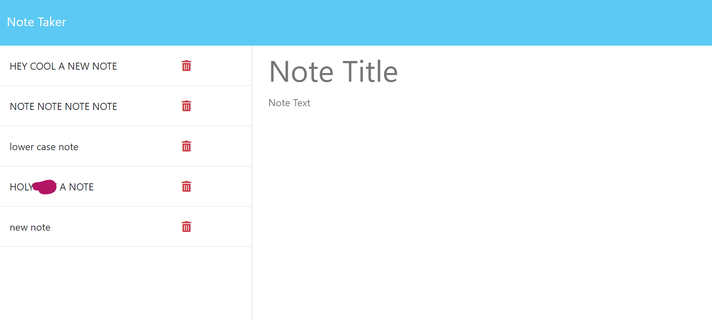

# Express.js Note Taker

This application is a note taker and manager using Express.js on the back end and JavaScript, HTML, and CSS on the front end. It uses JSON to format, write, and delete new tasks which is reflected onto the notes.html file. It will also save the tasks to the page even if the page is refreshed or reloaded. You can view the deployed project at [Heroku](https://note-taker-jjh-7c76d93cae0d.herokuapp.com/).

  - Using Express.js was very challenging and rewarding
  - Figuring out how to delete entries was particularly challenging
  - No more need to use paper in this all-in-one digital note taker!

## Installation

There are no installation requirements to run this application. All of the work is being done on the back end.

## Usage

The usage of this application is pretty straight-forward. Open `index.html`, add a new note title and a note text, click save, and BOOM, you have used the app. Below is an image of what the finished project looks like  

## Credits

The front end of this application was provided by my [Bootcamp](https://www.edx.org), the backend was created by [me](https://github.com/dsatpm) using [Express.js](https://expressjs.com/), and [fs](https://nodejs.org/api/fs.html).

### Additional Sources
  - [Stack Overflow](https://stackoverflow.com/)
    - 'app.delete' functionality
  - [Express.js](https://expressjs.com/)
    - Provided the backend server to run the application
  - [ChatGPT](https://chat.openai.com/)
    - Assisted with commenting code
    - Provided bug fixing when necessary

## Contributors

Anyone that wants to contribute, please refer to the [Contributor Convenant](https://www.contributor-covenant.org/) guidelines.

## License

